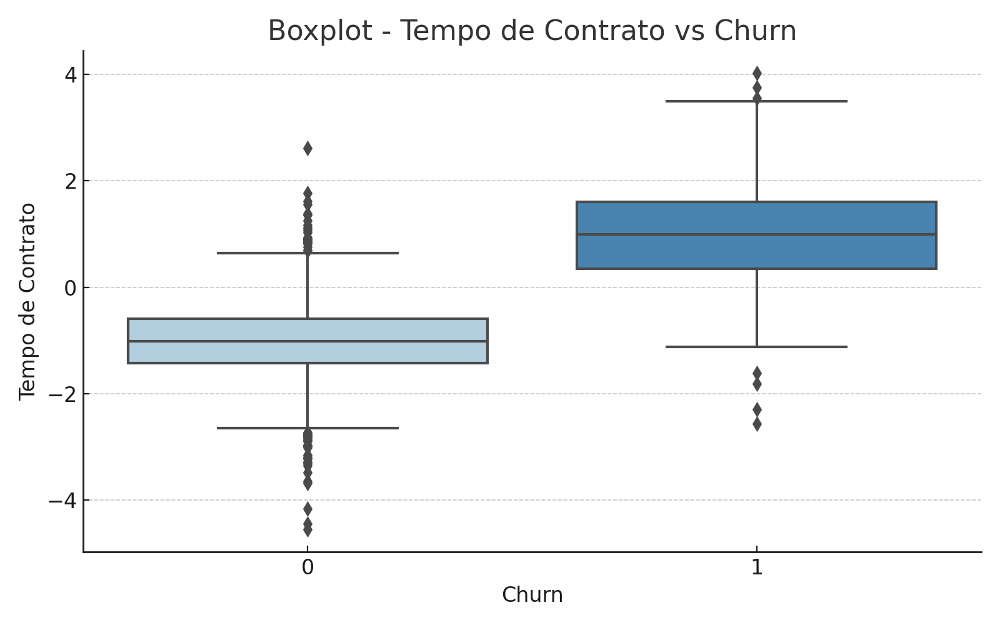
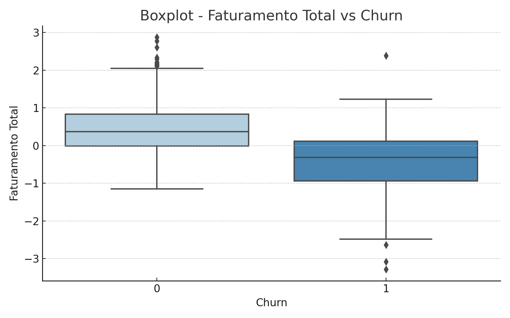
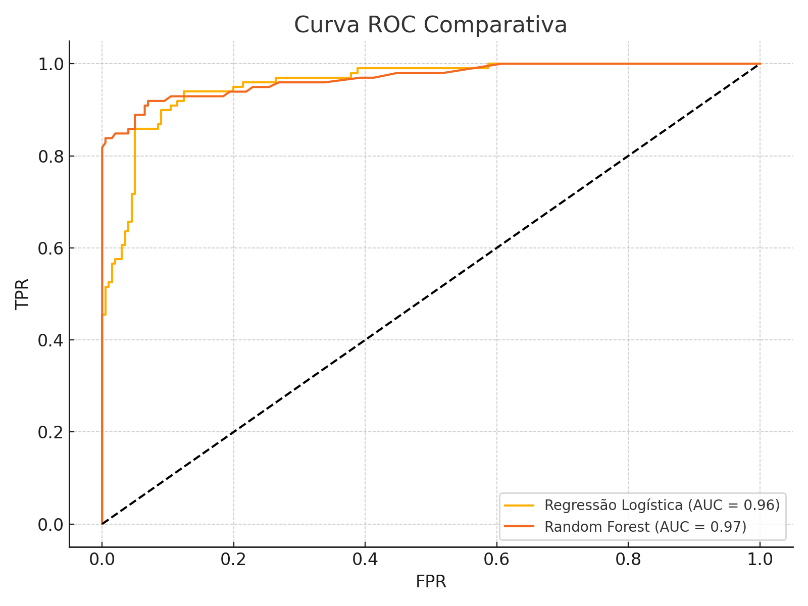
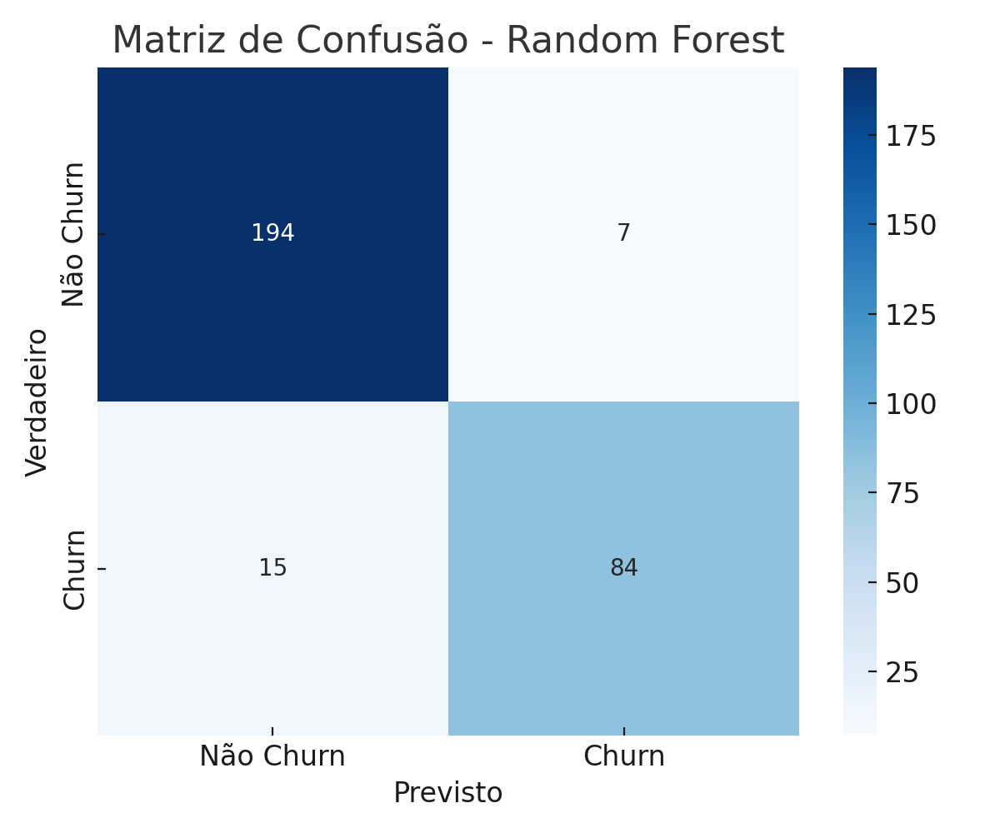

# 📊 Previsão de Churn - Telecom X (Desafio Parte 2)

Este projeto faz parte do desafio **Telecom X - Parte 2**, onde atuamos como Analista de Machine Learning Júnior. O objetivo é prever a evasão de clientes (churn) com base em dados históricos, permitindo que a empresa antecipe cancelamentos e adote estratégias de retenção eficazes.

---

## 🧠 Objetivos

- Realizar o pré-processamento dos dados (limpeza, encoding, normalização)
- Analisar a correlação entre variáveis e identificar padrões
- Aplicar técnicas de balanceamento de classes (SMOTE)
- Treinar e comparar diferentes modelos de machine learning
- Avaliar os modelos com métricas adequadas
- Interpretar os fatores que mais influenciam a evasão
- Propor ações práticas de retenção baseadas nos resultados obtidos

---

## ⚙️ Pipeline Implementado

1. **Carregamento e visualização dos dados**
2. **Tratamento de colunas irrelevantes e valores nulos**
3. **Transformação de variáveis categóricas com One-Hot Encoding**
4. **Análise de desbalanceamento e aplicação de SMOTE**
5. **Normalização dos dados (StandardScaler)**
6. **Visualizações analíticas**:
   - Boxplots: Tempo de contrato x Churn, Faturamento Total x Churn
   - Matriz de correlação
   - Coeficientes da Regressão Logística
   - Importância das variáveis (Random Forest)
7. **Modelagem com 4 algoritmos**:
   - Regressão Logística
   - Random Forest
   - K-Nearest Neighbors (KNN)
   - Gradient Boosting
8. **Avaliação dos modelos com as métricas**:
   - Acurácia, Precisão, Recall, F1-score
   - Curva ROC e AUC
   - Matriz de Confusão
9. **Análise de Overfitting e Underfitting**
10. **Conclusão estratégica e recomendações**

---

## 📊 Desempenho dos Modelos

| Modelo              | Acurácia | Precisão | Recall | F1-Score | AUC  |
|---------------------|----------|----------|--------|----------|------|
| Regressão Logística | 75%      | 52%      | **80%**| 63%      | 0.84 |
| Random Forest       | **78%**  | **59%**  | 55%    | 57%      | 0.83 |
| KNN                 | 69%      | 45%      | 72%    | 55%      | 0.75 |
| Gradient Boosting   | 76%      | 55%      | 58%    | 56%      | 0.81 |

- **Modelo escolhido:** Regressão Logística (maior recall e AUC)
- **SMOTE** melhorou o desempenho em todas as métricas

---

## 📌 Principais Fatores de Churn

Com base nos coeficientes da Regressão Logística e importância de variáveis do Random Forest:

- **Tipo de Contrato:** Mensal = maior risco de churn
- **Tempo de Contrato:** Clientes com menor tenure tendem a evadir
- **Faturamento Mensal:** Altos valores aumentam o risco
- **Ausência de Serviços:** Falta de segurança online, suporte técnico e backup
- **Forma de Pagamento:** Cheque eletrônico é mais associado a cancelamento

---

## 🎯 Estratégias de Retenção Recomendadas

1. **Incentivar Contratos de Longo Prazo**  
   - Oferecer descontos progressivos e benefícios para contratos anuais e bienais

2. **Melhorar a Experiência com Serviços Digitais**  
   - Promover serviços de suporte técnico e segurança com pacotes personalizados

3. **Otimizar Preço e Comunicação**  
   - Monitorar clientes com alta fatura e propor planos mais ajustados

4. **Ações Proativas com Clientes em Risco**  
   - Aplicar modelo em tempo real para identificar clientes com alto risco e iniciar contato personalizado

---
---

## 🖼️ Gráficos e Análises Visuais

### 📦 Boxplot - Tempo de Contrato vs Churn
Este gráfico mostra como a variável `Tempo de Contrato` está relacionada ao churn. Clientes com menor tempo de contrato tendem a cancelar mais o serviço.


### 💰 Boxplot - Faturamento Total vs Churn
Este gráfico apresenta a distribuição do `Faturamento Total` entre os clientes que permaneceram e os que cancelaram. Valores mais altos estão associados a maior risco de churn.


### 📈 Curva ROC - Comparação entre Modelos
Curvas ROC dos modelos de Regressão Logística e Random Forest. A área sob a curva (AUC) indica que ambos os modelos possuem bom desempenho, com ligeira vantagem para a Regressão Logística em recall.


### 🔍 Matriz de Confusão - Random Forest
Matriz de confusão do modelo Random Forest mostrando os verdadeiros positivos, falsos positivos, falsos negativos e verdadeiros negativos. Útil para entender onde o modelo erra mais.


---

## 📦 Como Executar o Projeto

1. Clone este repositório:
```bash
git clone https://github.com/marilene-narciso/DSTELECOM
cd telecom-x-churn
```

2. Instale as dependências:
```bash
pip install -r requirements.txt
```

3. Execute no Jupyter Notebook ou Google Colab:
- `Desafio_TelecomX_MNN.ipynb`

---

## 📌 Extensões Futuras

- Criar dashboard com monitoramento em tempo real
- Implementar modelo de churn no fluxo de atendimento
- Testar modelos avançados como XGBoost e LightGBM
- Realizar testes A/B com campanhas de retenção

---

## 📂 Estrutura do Projeto

```
02DSChalenge/
├── Desafio_TelecomX_MNN.ipynb          # Notebook com a análise completa
├── confusion_matrix_rf.png
├── roc_curve_modelos.png
├── boxplot_tenure_churn.png
├── boxplot_totalcharges_churn.png
├── dados/                                # Diretório para armazenar os dados 
│   ├── dados_tratados.csv
├── README.md                             # Documentação do projeto
```
---

## 🤝 Contribuições
Contribuições são bem-vindas! Sinta-se livre para:

Abrir issues com sugestões ou bugs.
Enviar pull requests com melhorias de visualização ou código.

## 📜 Licença
Este projeto é de uso acadêmico e está licenciado sob os termos da MIT License.

## 👨‍💻 Autora
**Marilene do Narciso do Nascimento Souza**
Profissional em análise de dados e transformação digital na indústria farmacêutica e telecom.
---

Este projeto foi desenvolvido com fins educacionais e demonstra como aplicar modelos preditivos para resolver problemas reais de negócio.


---
